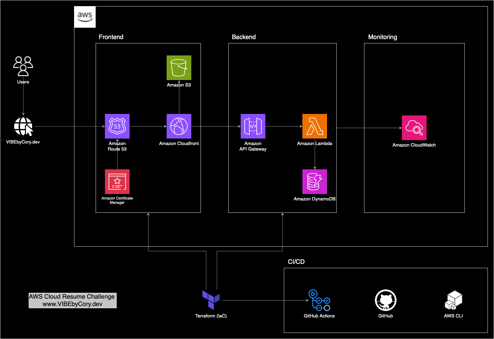

## My AWS Cloud Resume Challenge

### Overview

This repository demonstrates my attempt migrating a simple, on-premises “legacy” resume site into a fully serverless AWS cloud hosted site as my AWS Cloud Resume Challenge. (visit at <https://VIBEbyCory.dev>) 

This monorepo contains:

- **`legacy-resume/`**  
  A Node.js/Express app (HTML/CSS + SQLite) serving as the original local version of the resume and visitor counter.

- **`aws-infra/`**  
  Terraform modules and workspace code to provision:  
  • A private S3 bucket + CloudFront (with Origin Access Identity) for static hosting over HTTPS at a custom domain (via ACM & Route 53)  
  • A DynamoDB-backed Python Lambda + HTTP API for visitor counting (API Gateway v2)  
  • Automatic deployments and unit tests through GitHub Actions

---

## Features

- **Static Website Hosting**  
  • S3 bucket configured as private, with Public Access Block enabled  
  • CloudFront distribution (OAI) serving content over HTTPS  
  • Custom domain mapped via Route 53 A-alias at `www.vibebycory.dev` (ACM certificate requested & validated automatically)

- **Visitor Counter**  
  • DynamoDB table (`resume-visitor-counter`) storing a single “counter” item  
  • Python Lambda (runtime 3.9) updates and returns visitor count  
  • HTTP API (API Gateway v2) exposing `GET /count` endpoint

- **Infrastructure as Code (IaC)**  
  • Terraform modules for front-end (`static-site`) and back-end (`api-backend`)  
  • Environment workspace (`aws-infra/environments/dev`) orchestrates both modules

- **Unit Testing**  
  • Pytest + moto mocks DynamoDB locally to verify Lambda logic before any deploy  
  • Tests ensure initial counter creation, increment behavior, and error on missing environment variables

- **CI/CD Pipelines (GitHub Actions)**  
  • **Front-end workflow**: On changes under `legacy-resume/public/`, sync to S3 & invalidate CloudFront  
  • **Back-end workflow**: On changes under `aws-infra/`, run unit tests, then Terraform init/plan/apply

- **Monitoring & Alerts**
  Terraform modules in `monitoring/` create:\
    • An SNS topic (cloud-resume-alarms) to aggregate all alerts
    • **Back-end workflow**: On changes under `aws-infra/`, run unit tests, then Terraform init/plan/apply  

---

## Project Diagram



---

## Project Architecture

```
▸ legacy-resume/         “On-Prem” demo: Express + SQLite + static files
▸ aws-infra/
  ├─ modules/
  │   ├─ static-site/    (S3 bucket, CloudFront + OAI, Route 53, ACM certificate)
  │   └─ api-backend/    (DynamoDB table, IAM roles, Python Lambda, HTTP API Gateway)
  └─ environments/dev/   (Terraform workspace + Lambda source + tests)
     ├─ main.tf          Invokes both modules with proper variables
     ├─ lambda/          Python code for visitor counter
     └─ tests/           Pytest + moto unit tests for the Lambda logic
▸ .github/
  └─ workflows/
      ├─ deploy-frontend.yml    (Sync `legacy-resume/public/` → S3 + invalidate CloudFront) 
      └─ deploy-backend.yml     (Run tests → Terraform init/plan/apply)
```

---

## High-Level Directory Summary

- **`legacy-resume/`**  
  • Static HTML/CSS under `public/`  
  • `server.js` with a local SQLite (`visitors.db`) visitor counter  

- **`aws-infra/modules/`**  
  - **`static-site/`**  
    • Provisions a private S3 bucket, a CloudFront distribution with OAI, an ACM certificate (DNS-validated via Route 53), and the A-alias record for `vibebycory.dev`.  
  - **`api-backend/`**  
    • Creates a DynamoDB table, IAM role policies, packages and deploys a Python Lambda, and configures an HTTP API Gateway route (`GET /count`) to invoke that Lambda.  

- **`aws-infra/environments/dev/`**  
  • Calls both modules with environment-specific values (domain, bucket name, table name, etc.).  
  • Contains the Python `lambda_function.py` and its corresponding pytest tests under `tests/`.  

- **`.github/workflows/`**  
  • **`deploy-frontend.yml`**: Triggers on changes to front-end files → syncs them to S3 and invalidates CloudFront.  
  • **`deploy-backend.yml`**: Triggers on changes to Terraform/Lambda code → installs dependencies, runs moto tests, then Terraform deploy.

---

## Implementation Details

### Static Site Hosting
   - Terraform modules in `static-site/` create:  
     • A private S3 bucket with “Block Public Access” enabled  
     • An Origin Access Identity (OAI) for CloudFront to fetch objects  
     • A CloudFront distribution pointing at the S3 REST endpoint, with `aliases = ["vibebycory.dev"]`  
     • An ACM certificate in `us-east-1` for `vibebycory.dev`, automatically validated via a Route 53 DNS record in `vibebycory.dev`  
     • A Route 53 “A alias” record mapping `vibebycory.dev` → CloudFront distribution  

### Visitor Counter API
   - Terraform modules in `api-backend/` create:  
     • A DynamoDB table (`id` as the partition key, PAY_PER_REQUEST billing) to store a single `{"id":"counter","count":N}` item  
     • An IAM role and policies granting the Lambda execution and DynamoDB access rights  
     • A ZIP of all files under `environments/dev/lambda/` (using Terraform’s `archive_file`) for deployment  
     • A Python 3.9 Lambda function that:  
       1. Reads `count` from DynamoDB (default 0 if absent)  
       2. Increments and writes back the new `count`  
       3. Returns JSON like `{ "count": N }`  
     • An HTTP API Gateway v2 “AWS_PROXY” integration routing `GET /count` → Lambda  
     • A Lambda permission allowing API Gateway to invoke the function  

### Unit Testing
   - Located in `aws-infra/environments/dev/tests/test_lambda.py`  
   - Uses **pytest** and **moto** to spin up an in-memory DynamoDB:  
     • Verifies initial invocation sets `count = 1` when no item exists  
     • Verifies increment logic (e.g., `count` 5 → 6) when an item is pre-seeded  
     • Verifies missing `TABLE_NAME` environment variable triggers `KeyError`  

### CI/CD Workflows (GitHub Actions)
   - **Front-end** (`.github/workflows/deploy-frontend.yml`):  
     • Trigger: any change under `legacy-resume/public/`  
   - **Back-end** (`.github/workflows/deploy-backend.yml`):  
     • Trigger: any change under `aws-infra/`  
     
### Monitoring & Alarms
Terraform modules in `monitoring/` create:  
   - An SNS topic (`cloud-resume-alarms`) to aggregate all alerts
   -  CloudWatch alarms on the visitor-counter Lambda:
      - Errors (any invocation failures) 
      - Throttles (exceeded concurrency)
   - An AWS Budget configured monthly with an alert at your chosen threshold (e.g., 80%)
   - An IAM role trusted by AWS Chatbot
   - An AWS Chatbot Slack channel configuration that subscribes to the SNS topic and posts every alert into your chosen Slack channel

---

## Future Improvements

 - Revamp site to better reflect VIBEbyCory.dev brand
 - Include a resume pdf download button
 - Add Terraform staging and production workspaces and GitHub environment protections (manual approvals) before deploying to the live domain


## License

This project is licensed under the ISC License.

<!-- 
## My AWS Cloud Resume Challenge

### Overview

This repository demonstrates my attempt migrating a simple, on-premises “legacy” resume site into a fully serverless AWS cloud hosted site as my AWS Cloud Resume Challenge. (visit at <https://VIBEbyCory.dev>) 

This monorepo contains:

- **`legacy-resume/`**  
  A Node.js/Express app (HTML/CSS + SQLite) serving as the original local version of the resume and visitor counter.

- **`aws-infra/`**  
  Terraform modules and workspace code to provision:  
  • A private S3 bucket + CloudFront (with Origin Access Identity) for static hosting over HTTPS at a custom domain (via ACM & Route 53)  
  • A DynamoDB-backed Python Lambda + HTTP API for visitor counting (API Gateway v2)  
  • Automatic deployments and unit tests through GitHub Actions

---

## Features

- **Static Website Hosting**  
  • S3 bucket configured as private, with Public Access Block enabled  
  • CloudFront distribution (OAI) serving content over HTTPS  
  • Custom domain mapped via Route 53 A-alias at `www.vibebycory.dev` (ACM certificate requested & validated automatically)

- **Visitor Counter**  
  • DynamoDB table (`resume-visitor-counter`) storing a single “counter” item  
  • Python Lambda (runtime 3.9) updates and returns visitor count  
  • HTTP API (API Gateway v2) exposing `GET /count` endpoint

- **Infrastructure as Code (IaC)**  
  • Terraform modules for front-end (`static-site`) and back-end (`api-backend`)  
  • Environment workspace (`aws-infra/environments/dev`) orchestrates both modules

- **Unit Testing**  
  • Pytest + moto mocks DynamoDB locally to verify Lambda logic before any deploy  
  • Tests ensure initial counter creation, increment behavior, and error on missing environment variables

- **CI/CD Pipelines (GitHub Actions)**  
  • **Front-end workflow**: On changes under `legacy-resume/public/`, sync to S3 & invalidate CloudFront  
  • **Back-end workflow**: On changes under `aws-infra/`, run unit tests, then Terraform init/plan/apply

---

## Project Diagram


---

## Project Architecture

```
▸ legacy-resume/         “On-Prem” demo: Express + SQLite + static files
▸ aws-infra/
  ├─ modules/
  │   ├─ static-site/    (S3 bucket, CloudFront + OAI, Route 53, ACM certificate)
  │   └─ api-backend/    (DynamoDB table, IAM roles, Python Lambda, HTTP API Gateway)
  └─ environments/dev/   (Terraform workspace + Lambda source + tests)
     ├─ main.tf          Invokes both modules with proper variables
     ├─ lambda/          Python code for visitor counter
     └─ tests/           Pytest + moto unit tests for the Lambda logic
▸ .github/
  └─ workflows/
      ├─ deploy-frontend.yml    (Sync `legacy-resume/public/` → S3 + invalidate CloudFront) 
      └─ deploy-backend.yml     (Run tests → Terraform init/plan/apply)
```

---

## High-Level Directory Summary

- **`legacy-resume/`**  
  • Static HTML/CSS under `public/`  
  • `server.js` with a local SQLite (`visitors.db`) visitor counter  

- **`aws-infra/modules/`**  
  - **`static-site/`**  
    • Provisions a private S3 bucket, a CloudFront distribution with OAI, an ACM certificate (DNS-validated via Route 53), and the A-alias record for `vibebycory.dev`.  
  - **`api-backend/`**  
    • Creates a DynamoDB table, IAM role policies, packages and deploys a Python Lambda, and configures an HTTP API Gateway route (`GET /count`) to invoke that Lambda.  

- **`aws-infra/environments/dev/`**  
  • Calls both modules with environment-specific values (domain, bucket name, table name, etc.).  
  • Contains the Python `lambda_function.py` and its corresponding pytest tests under `tests/`.  

- **`.github/workflows/`**  
  • **`deploy-frontend.yml`**: Triggers on changes to front-end files → syncs them to S3 and invalidates CloudFront.  
  • **`deploy-backend.yml`**: Triggers on changes to Terraform/Lambda code → installs dependencies, runs moto tests, then Terraform deploy.

---

## Implementation Details

1. **Static Site Hosting**  
   - Terraform modules in `static-site/` create:  
     • A private S3 bucket with “Block Public Access” enabled  
     • An Origin Access Identity (OAI) for CloudFront to fetch objects  
     • A CloudFront distribution pointing at the S3 REST endpoint, with `aliases = ["vibebycory.dev"]`  
     • An ACM certificate in `us-east-1` for `vibebycory.dev`, automatically validated via a Route 53 DNS record in `vibebycory.dev`  
     • A Route 53 “A alias” record mapping `vibebycory.dev` → CloudFront distribution  

2. **Visitor Counter API**  
   - Terraform modules in `api-backend/` create:  
     • A DynamoDB table (`id` as the partition key, PAY_PER_REQUEST billing) to store a single `{"id":"counter","count":N}` item  
     • An IAM role and policies granting the Lambda execution and DynamoDB access rights  
     • A ZIP of all files under `environments/dev/lambda/` (using Terraform’s `archive_file`) for deployment  
     • A Python 3.9 Lambda function that:  
       1. Reads `count` from DynamoDB (default 0 if absent)  
       2. Increments and writes back the new `count`  
       3. Returns JSON like `{ "count": N }`  
     • An HTTP API Gateway v2 “AWS_PROXY” integration routing `GET /count` → Lambda  
     • A Lambda permission allowing API Gateway to invoke the function  

3. **Unit Testing**  
   - Located in `aws-infra/environments/dev/tests/test_lambda.py`  
   - Uses **pytest** and **moto** to spin up an in-memory DynamoDB:  
     • Verifies initial invocation sets `count = 1` when no item exists  
     • Verifies increment logic (e.g., `count` 5 → 6) when an item is pre-seeded  
     • Verifies missing `TABLE_NAME` environment variable triggers `KeyError`  

4. **CI/CD Workflows (GitHub Actions)**  
   - **Front-end** (`.github/workflows/deploy-frontend.yml`):  
     • Trigger: any change under `legacy-resume/public/`  
     
   - **Back-end** (`.github/workflows/deploy-backend.yml`):  
     • Trigger: any change under `aws-infra/`  
     

---

## Future Improvements

 - Integrate CloudWatch alarms (Lambda errors, throttles, budget thresholds) with Slack or PagerDuty for real-time notifications.
 - Revamp site to better reflect VIBEbyCory.dev brand
 - Include a resume pdf download button
 - Add Terraform staging and production workspaces and GitHub environment protections (manual approvals) before deploying to the live domain


## License

This project is licensed under the ISC License. -->
